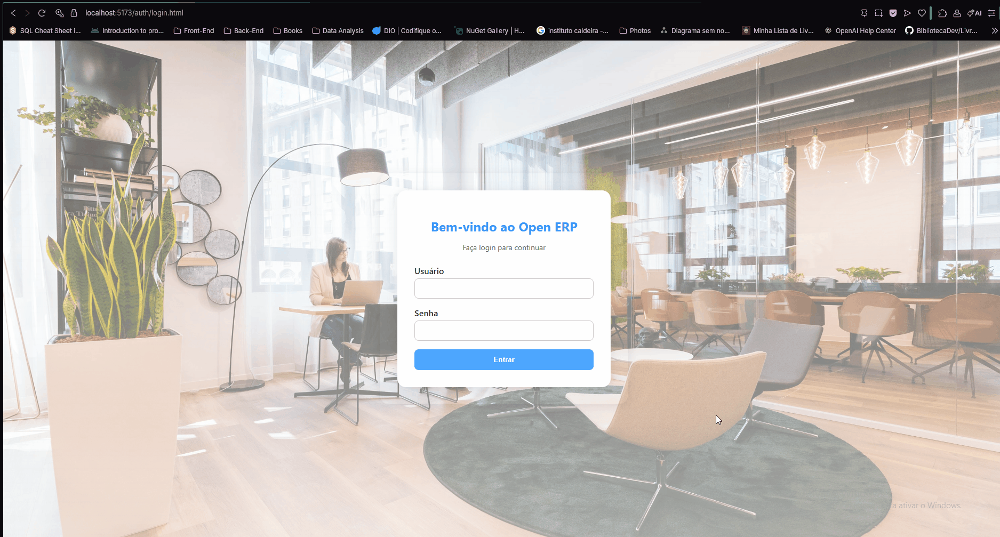
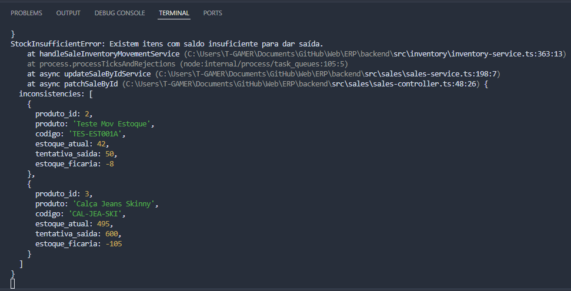
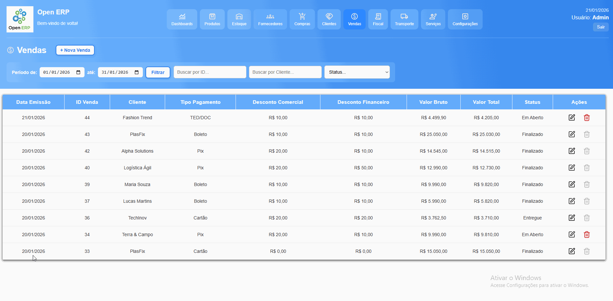
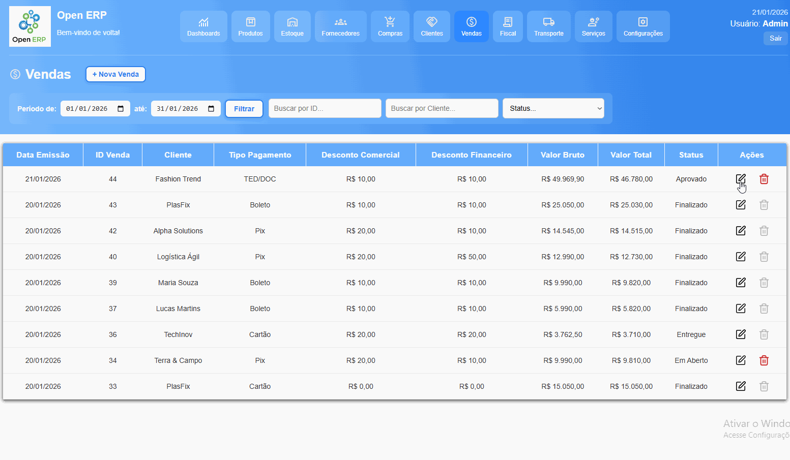
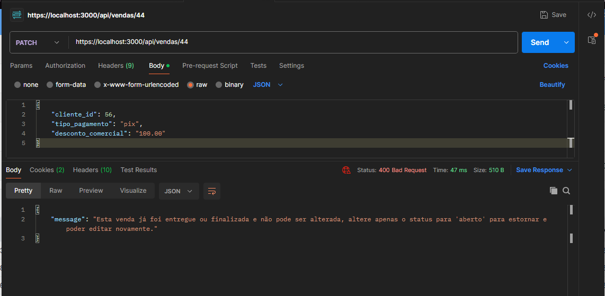
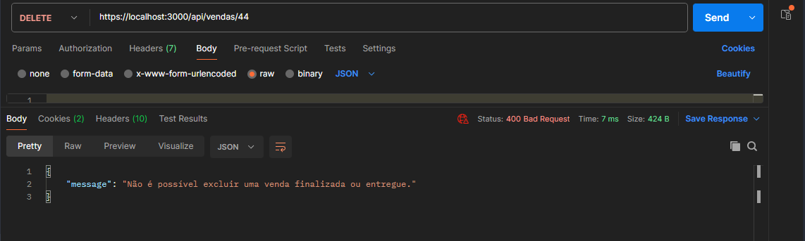
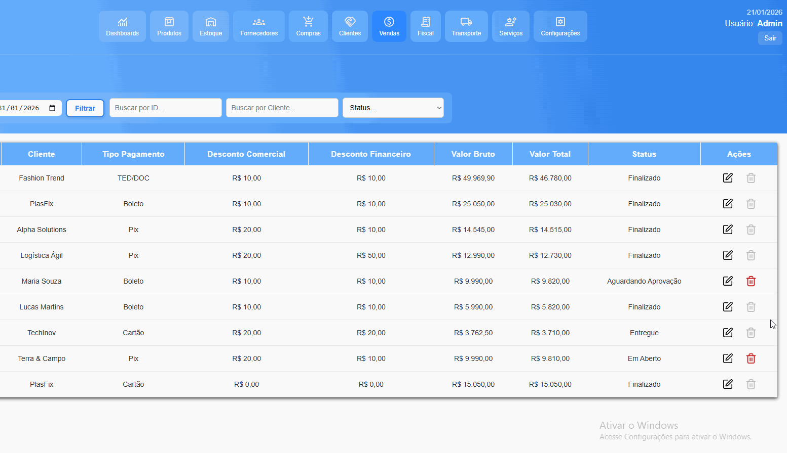
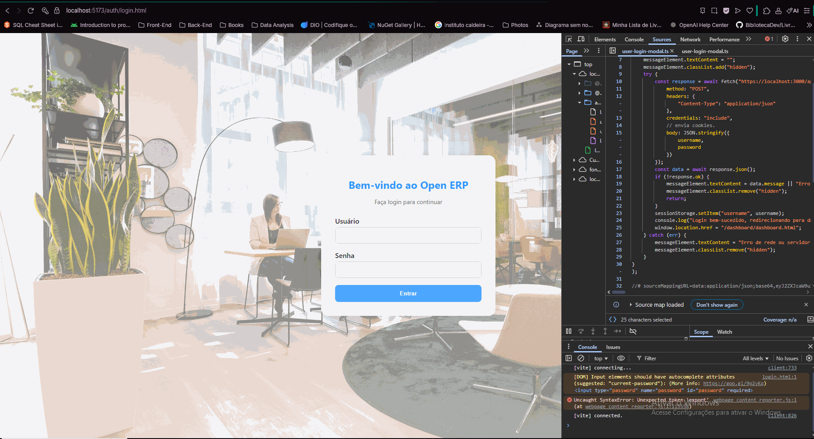

# 📦 Open ERP

## 📌 Visão Geral
Um **ERP (Enterprise Resource Planning)** — ou *Planejamento de Recursos Empresariais* — é uma aplicação de gestão que integra múltiplos setores da empresa em um único sistema centralizado.

Este projeto foi desenvolvido com foco em **simular um ERP real**, indo além de CRUDs básicos, aplicando **regras de negócio reais**, validações consistentes e fluxos comuns ao ambiente corporativo.

O objetivo é demonstrar habilidades em **análise de sistemas, arquitetura em camadas, implementação de regras de negócio, segurança de software**, desenvolvimento backend/frontend e integração com banco de dados relacional.




---

## 📑 Sumário
1. [Tecnologias Utilizadas](#tecnologias-utilizadas)
2. [Arquitetura do Sistema](#arquitetura-do-sistema)
3. [Módulos e Regras de Negócio](#módulos-e-regras-de-negócio)
4. [Segurança e Boas Práticas](#segurança-e-boas-práticas)
5. [Demonstração](#demonstração)

---

## 🛠 Tecnologias Utilizadas
**Frontend:** HTML, CSS, TypeScript e Vite.

**Backend:** Node.js, Typescript e Express.

**Banco de Dados:** PostgreSQL.  

**Outras:**
- JWT para autenticação
- bcrypt para hashing de senhas
- Cookie-parser para utilização de cookies

---

## 🏗 Arquitetura do Sistema
O projeto adota **arquitetura em camadas**, com separação clara de responsabilidades.

Cada pasta representa um **módulo de negócio** (ex.: produtos, fornecedores, compras), e dentro cada módulos os arquivos seguem a divisão por responsabilidade.

## Back-end

Organização modular com arquitetura em camadas.

Fluxo:
Routes → Controllers → Services → Repositories → Models

### Exemplo de estrutura:

```text
backend
└── src
    ├── app.ts                 # Configurações gerais da API
    |
    ├── config                 # Configurações do servidor
    │   ├── db.ts              # Conexão com o banco de dados
    │   ├── server.ts          # Inicialização do servidor
    │   └── .env               # Variáveis de ambiente
    |
    ├── products               # Módulo de produtos
    │   ├── routes.ts          # Rotas do módulo
    │   ├── controllers.ts     # Controladores
    │   ├── services.ts        # Regras de negócio
    │   ├── repositories.ts    # Interação com o Banco de Dados
    │   └── models.ts          # Modelos de dados
    |
    ├── suppliers              # Módulo de fornecedores
    │   ├── routes.ts          
    │   ├── controllers.ts     
    │   ├── services.ts        
    │   ├── repositories.ts    
    │   └── models.ts          
    |
    └── customers              # Módulo de clientes
        ├── routes.ts
        ├── controllers.ts
        ├── services.ts
        ├── repositories.ts
        └── models.ts
```
## Front-end


Segue o mesmo conceito de **módulos + responsabilidades**, adaptado à camada de interface e interação com o usuário.

### Exemplo de estrutura:

```text
frontend
└── src
    ├── products
    │   ├── products.html              # Página HTML
    │   ├── products-style.css         # Estilos CSS
    │   ├── register-global-events.ts  # Eventos globais
    │   ├── script.ts                  # Script principal
    │   ├── product-events.ts          # Eventos específicos
    │   ├── product-dom.ts             # Manipulação do DOM
    │   ├── new-product-modal.ts       # Modal de novo produto
    │   ├── product-edit-modal.ts      # Modal de edição
    │   ├── product-service.ts         # Comunicação com a API
    │   └── product-model.ts           # Modelo de dados
    |
    ├── suppliers
    │   └── ...
    |
    ├── customers
    │   └── ...
    |
    └── utils
        ├── fetch-helper.ts            # Fetch autenticado
        ├── navigation.ts              # Navegação entre módulos
        ├── formatters.ts              # Máscaras e formatações
        ├── messages.ts                # Mensagens de sistema
        └── autocomplete.ts            # Autocomplete
```
---

## 📂 Módulos e Regras de Negócio

Esta seção descreve as **principais regras de negócio implementadas no sistema**, com destaque para aquelas que simulam **cenários reais e críticos de um ERP**, especialmente relacionadas a **controle de estoque, integridade de dados e histórico das operações**.


## 🔴 Regras Críticas de Estoque

### Bloqueio de Estoque Negativo
O sistema **não permite que o estoque de um produto fique negativo** em nenhuma operação crítica.

Essa regra é aplicada nos seguintes cenários:
- Finalização de vendas
- Estorno de compras
- Ajustes manuais de estoque

Antes de qualquer operação que reduza o estoque, o sistema valida se a quantidade disponível é suficiente.  

Caso contrário, a operação é **bloqueada** e uma mensagem clara é retornada ao usuário.

**Objetivo da regra:**
- Garantir consistência de dados
- Evitar divergência entre estoque físico e sistema
- Simular comportamento real de ERPs comerciais

---

### Finalização de Venda com Validação de Estoque
No momento da finalização de uma venda, o sistema executa o seguinte fluxo:

1. Front-end coleta os dados da venda e dos produtos e envia ao **back-end**

2. O **Back-end valida** se o status foi alterado de *aberto* para *finalizado*.

3. Caso seja uma finalização:
- Consulta o saldo atual dos produtos
- Calcula o saldo após a saída
- Se algum produto ficar com saldo negativo, a operação é **bloqueada**
- O back-end retorna um objeto JSON com as informações dos produtos bloqueados para ser exibida  no front-end:





4. Se o estoque for suficiente:
- A venda é finalizada
- O saldo de estoque é atualizado
- A movimentação é registrada no histórico




5. Após finalização:
- A venda **não pode ser editada nem excluída**
- O back-end bloqueia qualquer tentativa de alteração
- O front-end bloqueia os campos e ações como reforço visual

Tentativa de alteração:



Tentativa de exclusão:



Bloqueio visual no front-end:


---

### Estorno de Compras e Ajustes de Estoque
O sistema trata **estornos de compras** e **ajustes manuais de estoque** como **operações críticas**, aplicando a **mesma lógica de validação, rastreabilidade e auditoria** utilizada na finalização de vendas.

Todas essas operações:
- Validam o impacto no saldo do estoque
- Bloqueiam qualquer ação que resulte em **estoque negativo**
- Geram registros completos de movimentação, contendo:
  - ID da transação
  - Tipo da operação
  - Produto e quantidade
  - Usuário responsável
  - Data e hora da ação

---

### Estorno de Compras
O estorno de compras representa a **ação reversa de uma compra finalizada**.

Fluxo resumido:
- A compra deve estar com status **finalizada**
- O sistema calcula a reversão das quantidades previamente adicionadas ao estoque
- Caso o estorno resulte em saldo negativo, a operação é **bloqueada**
- Quando válido:
  - O estoque é ajustado revertendo a entrada
  - A movimentação é registrada no histórico
  - O status da compra retorna para **aberta**

Esse comportamento garante consistência entre compras, vendas e saldo atual dos produtos.

---

### Ajustes Manuais de Estoque
Os ajustes manuais permitem correções administrativas, inventários ou perdas controladas.

Regras aplicadas:
- Ajustes de saída passam por validação de saldo
- Não é permitido gerar estoque negativo
- Todo ajuste é registrado como movimentação auditável

Essa abordagem evita alterações silenciosas e mantém a integridade do estoque ao longo do tempo.

----

## 🔐 Segurança da Aplicação
A aplicação foi projetada com foco em **segurança no back-end**, garantindo que os dados permaneçam protegidos **independentemente de qualquer tentativa de burlar o front-end**.

### Proteção de Rotas
Todas as rotas do **back-end são protegidas por middleware de autenticação**.  
Isso significa que **nenhuma operação pode ser executada sem um usuário autenticado**.

### Caso de uso

Vamos supor que um atacante acesse a página inicial da aplicação (login), e através da ferramenta dev tools, o mesmo consiga visualizar a rota da API que é chamada ao fazer a autenticação, e também para qual página é redirecionada caso o login seja bem sucedido.

Caso o mesmo tente realizar qualquer requisição direto para o back-end via POSTMAN/Insomnia, seja na própria rota de autenticação ou presumindo outras possíveis rotas dentro da aplicação, todas as requisições serão barradas pelo middleware:


### Proteção extra no front-end

Caso o atacante tente acessar caminhos de outras páginas dentro da aplicação, as informações não irão ser carregadas devido á falta do JWT, mas ainda irá ter acesso á interface do sistema.

Resolvemos isso da seguinte forma:

- Criamos uma função chamada showNotAuthorizedMessage, essa função:
- Limpa o body do HTML
- Após limpar todo o HTML, cria uma div que bloqueia e cobre a tela inteira, informando sessão não autorizada
- Redireciona para a página inicial de login
- Acoplamos esta função no nosso fetch-helper, cujo objetivo é realizar requisições autorizadas ao back-end utilizando cookies.
- Caso a requisição feita para o back-end retorne 401 (Not authorized), a função de fetch autorizada automaticamente chama a função showNotAuthorizedMessage, limpando todo o HTML, criando uma div e bloqueando qualquer interação via interface.



## Cadastro de armazenamento de senhas

[ Em construção ]
